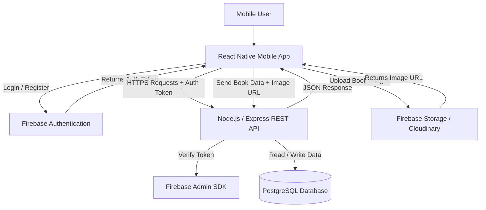
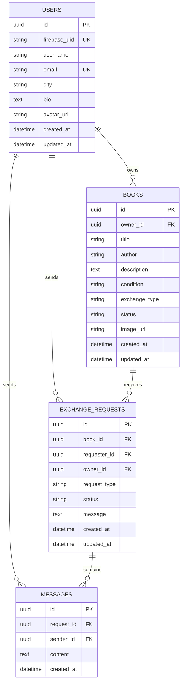
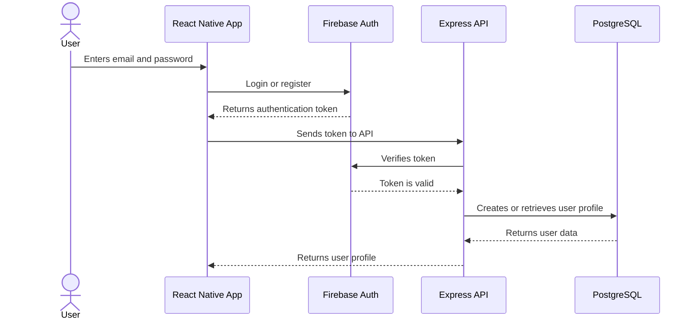
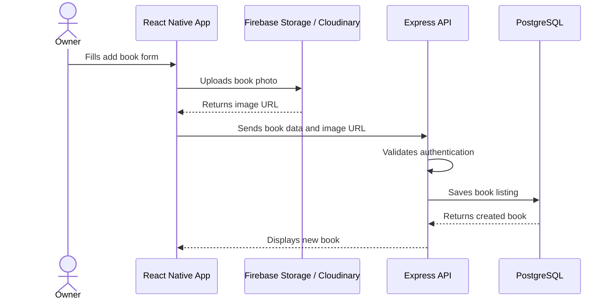
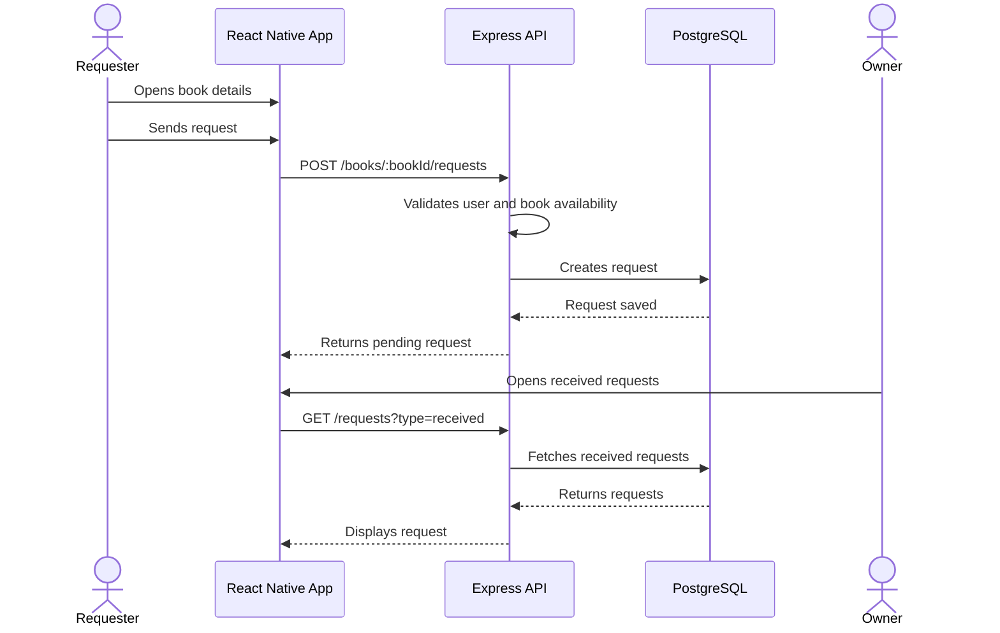

# Livract — System Architecture

## Overview

Livract is a mobile application that allows users in a local community to share, lend, give, or exchange books.

The MVP uses a **3-tier modular architecture**:

```text
Mobile App → REST API → Database
```

The architecture is designed to be simple, scalable, and realistic for a first MVP developed by a small team.

---

## Recommended Architecture

Livract uses:

| Layer | Technology |
|---|---|
| Front-end | React Native |
| Back-end | Node.js + Express.js |
| Database | PostgreSQL |
| Authentication | Firebase Authentication |
| Image Storage | Firebase Storage or Cloudinary |
| API Style | REST API |
| Version Control | GitHub |

---

## High-Level Architecture Diagram



---

## Architecture Type

Livract follows a **3-tier modular architecture**.

### 1. Presentation Layer

The presentation layer is the mobile application built with **React Native**.

It is responsible for:

- displaying the user interface;
- handling user interactions;
- showing books, profiles, requests, and messages;
- sending requests to the back-end API;
- storing the authentication token locally.

---

### 2. Application Layer

The application layer is the back-end API built with **Node.js** and **Express.js**.

It is responsible for:

- receiving requests from the mobile app;
- verifying authentication tokens;
- applying business rules;
- managing users, books, requests, and messages;
- communicating with the database;
- returning JSON responses.

---

### 3. Data Layer

The data layer uses **PostgreSQL**.

It stores:

- users;
- book listings;
- exchange or borrowing requests;
- messages;
- book availability status.

PostgreSQL is a good choice because Livract has clear relationships between data entities.

Example relationships:

```text
User → Books
User → Requests
Book → Requests
Request → Messages
```

---

## Why This Architecture Was Chosen

This architecture is the best choice for the Livract MVP because it is:

- simple enough for a first version;
- easy to build with a small team;
- easy to explain in documentation;
- scalable enough for future improvements;
- compatible with mobile development;
- not overcomplicated with unnecessary microservices.

The MVP does not require microservices because the project is still small. A single modular back-end is easier to develop, test, debug, and deploy.

---

## Back-End Structure

The back-end should be organized as a **modular monolith**.

This means the project has one back-end application, but the code is separated into clear modules.

```text
backend/
├── src/
│   ├── modules/
│   │   ├── auth/
│   │   ├── users/
│   │   ├── books/
│   │   ├── requests/
│   │   └── messages/
│   │
│   ├── config/
│   ├── database/
│   ├── middlewares/
│   ├── utils/
│   └── server.js
│
├── package.json
└── README.md
```

---

## Main Back-End Modules

| Module | Responsibility |
|---|---|
| Auth Module | Verifies Firebase authentication tokens |
| User Module | Manages user profiles |
| Book Module | Creates, updates, deletes, and searches books |
| Request Module | Handles borrow, give, and exchange requests |
| Message Module | Handles basic messages linked to requests |
| Database Module | Manages PostgreSQL connection and queries |

---

## Front-End Structure

The mobile app should be organized by screens and reusable components.

```text
frontend/
├── src/
│   ├── screens/
│   │   ├── AuthScreen.js
│   │   ├── HomeScreen.js
│   │   ├── BookDetailsScreen.js
│   │   ├── AddBookScreen.js
│   │   ├── MyBooksScreen.js
│   │   ├── RequestsScreen.js
│   │   ├── ChatScreen.js
│   │   └── ProfileScreen.js
│   │
│   ├── components/
│   │   ├── BookCard.js
│   │   ├── SearchBar.js
│   │   ├── FilterModal.js
│   │   ├── RequestCard.js
│   │   └── MessageBubble.js
│   │
│   ├── services/
│   │   ├── api.js
│   │   ├── authService.js
│   │   ├── bookService.js
│   │   └── requestService.js
│   │
│   └── navigation/
│       └── AppNavigator.js
│
├── package.json
└── README.md
```

---

## Database Design

The database is relational and uses PostgreSQL.

### Main Tables



---

## Main Data Flow

### User Authentication



---

### Add a Book



---

### Send a Book Request



---

## Internal API Overview

Base URL:

```text
/api/v1
```

### Authentication and Users

| Method | Endpoint | Description |
|---|---|---|
| POST | `/auth/sync` | Creates or updates a user after Firebase login |
| GET | `/users/me` | Returns the current user profile |
| PATCH | `/users/me` | Updates the current user profile |
| GET | `/users/:id` | Returns a public user profile |

---

### Books

| Method | Endpoint | Description |
|---|---|---|
| GET | `/books` | Returns available books with optional search and filters |
| POST | `/books` | Creates a new book listing |
| GET | `/books/:id` | Returns details of one book |
| PATCH | `/books/:id` | Updates a book listing |
| DELETE | `/books/:id` | Deletes a book listing |
| GET | `/users/me/books` | Returns books owned by the current user |

---

### Requests

| Method | Endpoint | Description |
|---|---|---|
| POST | `/books/:bookId/requests` | Sends a request for a book |
| GET | `/requests` | Returns sent or received requests |
| GET | `/requests/:id` | Returns one request |
| PATCH | `/requests/:id/status` | Updates request status |

---

### Messages

| Method | Endpoint | Description |
|---|---|---|
| GET | `/requests/:id/messages` | Returns messages for a request |
| POST | `/requests/:id/messages` | Sends a message inside a request conversation |

---

## External Services

| Service | Purpose |
|---|---|
| Firebase Authentication | Handles login and registration |
| Firebase Admin SDK | Allows the back-end to verify user tokens |
| Firebase Storage or Cloudinary | Stores book images |
| GitHub | Hosts source code and supports collaboration |

---

## Security Considerations

The API should include:

- authentication middleware;
- token verification with Firebase Admin SDK;
- protected routes for creating books and requests;
- permission checks for editing or deleting books;
- permission checks for accepting or rejecting requests;
- input validation for all API requests;
- secure storage of environment variables;
- HTTPS in production.

---

## Scalability Considerations

The MVP starts with a simple architecture, but it can evolve later.

Possible future improvements:

- real-time messaging using WebSockets;
- push notifications;
- admin dashboard;
- recommendation system;
- location-based search;
- moderation system;
- deployment with Docker;
- caching with Redis.

---

## Final Architecture Choice

The best architecture for Livract is:

```text
React Native Mobile App
        ↓
Node.js / Express REST API
        ↓
PostgreSQL Database
```

With:

```text
Firebase Authentication for login
Firebase Storage or Cloudinary for images
GitHub for version control
```

This architecture is simple, realistic, and well-suited for the first MVP of Livract.
