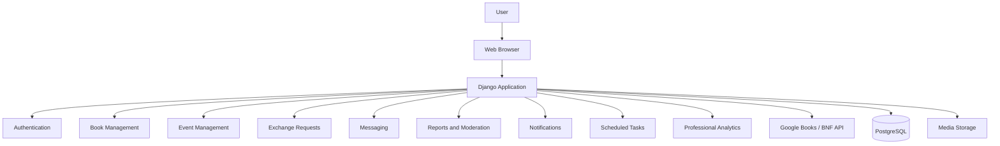
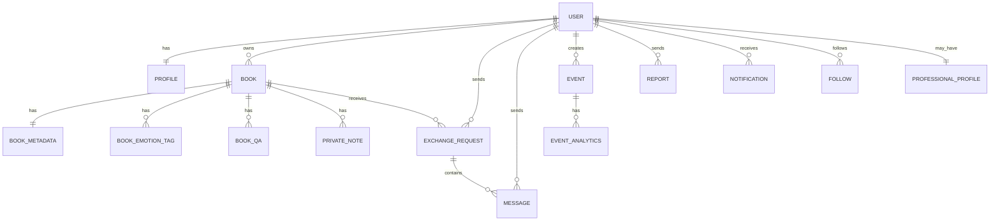
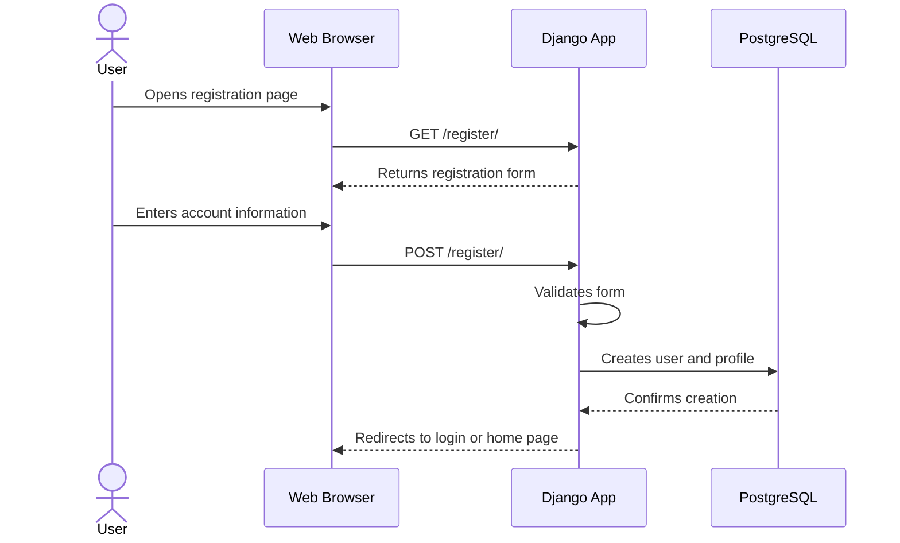
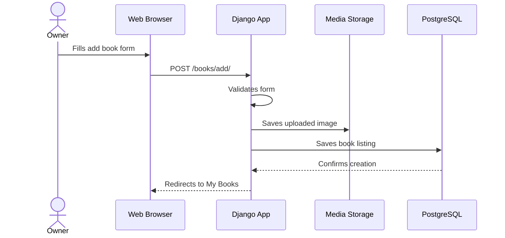

# Livract — MVP Technical Documentation

<p align="center">
  
  
  
  
  
  
</p>

<p align="center">
  <b>Python</b> • <b>Django</b> • <b>PostgreSQL</b> • <b>HTML</b> • <b>CSS</b> • <b>Git</b>
</p>

---

## Table of Contents

- [Project Overview](#project-overview)
- [Chosen Stack](#chosen-stack)
- [0. User Stories and Mockups](#0-user-stories-and-mockups)
- [1. System Architecture](#1-system-architecture)
- [2. Components, Classes, and Database Design](#2-components-classes-and-database-design)
- [3. High-Level Sequence Diagrams](#3-high-level-sequence-diagrams)
- [4. Internal and External APIs](#4-internal-and-external-apis)
- [5. SCM and QA Strategy](#5-scm-and-qa-strategy)
- [Final Summary](#final-summary)

---

## Project Overview
Livract is a web application that helps people in a local community share, lend, give, exchange, or sell books.

## Chosen Stack
| Layer | Technology |
|---|---|
| Front-end | HTML, CSS, Django Templates |
| Back-end | Python, Django |
| Database | PostgreSQL |
| Authentication | Django Authentication |
| Media Storage | Local media storage for MVP |
| Background Tasks | Django command / scheduled job |
| Version Control | Git and GitHub |

---

# 0. User Stories and Mockups

## 0.1 MVP Goal
The MVP must prove that users can share books and organize local exchanges safely.
The first version must be simple, testable, and usable.
It must not contradict the cahier des charges.
The MVP does not need subscriptions, AI recommendations, delivery tracking, a native mobile app, or live real-time geolocation.

## 0.2 User Stories

### Must Have
* As a reader, I want to register and log in, so that I can access the platform securely.
* As a reader, I want to create and edit my profile, so that other users can identify me.
* As a reader, I want to add a book using an external metadata API such as Google Books or BNF, so that book creation is faster.
* As a reader, I want to manually complete or correct imported book information, so that book profiles stay accurate.
* As a reader, I want to enrich a book profile with emotion tags, personalized Q&A, and private notes, so that my library reflects my reading experience.
* As a reader, I want private notes to remain visible only to me, so that personal thoughts stay confidential.
* As a reader, I want to browse nearby books on a map without seeing exact addresses, so that user privacy is protected.
* As a reader, I want book locations to use a 500m privacy radius and a 1km blurred display, so that exact positions are never exposed.
* As a reader, I want to send a loan, gift, exchange, or sale request, so that I can obtain a book from another reader.
* As a book owner, I want to accept or decline requests, so that I stay in control of my books.
* As a reader, I want to chat after a request is accepted, so that we can organize the exchange.
* As a reader, I want unavailable books to disappear automatically from public search, so that I only see active listings.
* As a reader, I want notifications for messages, request updates, validations, and new books nearby, so that I do not miss important activity.
* As a reader, I want to follow other readers, so that I can be notified of their activity.
* As a user, I want to report inappropriate books, events, or users, so that the community stays safe.
* As an admin, I want to validate or delete reported content, so that I can moderate the platform.
* As an admin, I want to suspend or ban users, so that I can protect the community.
* As a user, I want to create local literary events, so that readers nearby can discover them.
* As a user, I want past events to be automatically removed from the public agenda, so that the event list stays clean.
* As a user, I want to share literary events to social networks, so that I can promote local literary activity.
* As a professional, I want event statistics, so that I can track views, interested users, and geographic reach.

### Should Have
* As a reader, I want to filter books by exchange type, distance, genre, and condition, so that I can quickly find relevant books.
* As a reader, I want to search books by title, author, genre, or theme, so that I can find a specific book.
* As a reader, I want to browse events by type and date, so that I can participate in the local literary scene.
* As a professional, I want to see how many free event slots I have left, so that I know when payment may be needed.
* As an admin, I want to manage professional accounts and quotas, so that paid features remain controlled.

### Could Have
* As a reader, I want to earn a reader title based on my activity, so that my profile reflects my reading personality.
* As a reader, I want advanced book recommendations, so that I can discover books matching my tastes.
* As a professional, I want advanced analytics exports, so that I can analyze performance outside the platform.

### Won't Have
* Monthly professional subscription for unlimited event posting.
* AI-powered recommendations in the first MVP.
* Global revenue dashboard for admins.
* Native mobile application.
* Real-time live geolocation.

## 0.3 Mockups
The MVP uses a simple web interface.
Wireframes can be created in Figma, but the following defines the expected structure.

**Professional mockup:** [View the mockup on Figma](https://glove-seven-74328689.figma.site/)

**User mockup:** [View the mockup on Figma](https://www.figma.com/make/ffQLGzHnM3EsID4ED9aNhu/Livract-Lecteurs?p=f)

| Screen | Purpose |
|---|---|
| Login Page | Log in existing users. |
| Register Page | Create a new account. |
| Home Page | Display nearby available books. |
| Map Page | Display privacy-protected approximate book locations. |
| Book Details Page | Show book information, emotion tags, Q&A, and public details. |
| Add Book Page | Add a book manually or through an external metadata API. |
| Edit Book Page | Update an owned book listing. |
| My Books Page | Show books created by the current user. |
| Private Notes Page | Manage notes visible only to the owner. |
| Requests Page | Show sent and received requests. |
| Messages Page | Show messages linked to an accepted request. |
| Events Page | Show nearby literary events. |
| Add Event Page | Create a literary event. |
| Notifications Page | Show user notifications. |
| Profile Page | Show and edit user profile information. |
| Admin Reports Page | Review reports and moderation actions. |
| Professional Dashboard | Show event statistics and quota information. |

---

# 1. System Architecture

## 1.1 Architecture Choice
Livract uses a modular Django architecture for the MVP.
The implementation stays simple enough for a small team.

```text
Web Browser → Django Application → PostgreSQL Database
```

Django handles routing, templates, authentication, permissions, privacy rules, moderation workflows, notifications, scheduled tasks, and business logic.
PostgreSQL stores users, profiles, books, metadata, events, reports, requests, messages, notifications, professional accounts, analytics data, and geolocation information.
For geolocation, the MVP can start with indexed latitude and longitude fields and later evolve toward PostGIS if spatial search becomes heavier.

## 1.2 Architecture Diagram


## 1.3 Architecture Layers
| Layer | Responsibility |
|---|---|
| Presentation | Displays pages, forms, book cards, maps, events, requests, messages, notifications, and admin screens. |
| Application | Validates actions, checks permissions, applies privacy rules, controls workflows, and runs business logic. |
| Data | Stores relational data in PostgreSQL. |
| External Integration | Connects to Google Books or BNF for book metadata. |
| Automation | Runs cleanup and visibility tasks. |

## 1.4 Why This Architecture Fits
- It is understandable for a small team.
- It can be built mainly with Python.
- It matches the chosen Django stack.
- It can evolve toward REST APIs, mobile support, PostGIS, caching, cloud storage, and background workers.

---

# 2. Components, Classes, and Database Design

## 2.1 Front-End Components
| Component | Type | Responsibility |
|---|---|---|
| BaseTemplate | Template | Shared layout and navigation. |
| HomePage | Page | Nearby available books. |
| MapPage | Page | Privacy-protected approximate locations. |
| LoginPage | Page | Login form. |
| RegisterPage | Page | Registration form. |
| ProfilePage | Page | User profile information. |
| BookCard | Partial | Short book preview. |
| BookDetailsPage | Page | Detailed book information. |
| AddBookPage | Page | Manual or API-based book creation. |
| EditBookPage | Page | Book editing. |
| RequestsPage | Page | Sent and received requests. |
| MessagesPage | Page | Conversation for accepted request. |
| EventsPage | Page | Local literary events. |
| NotificationsPage | Page | User notifications. |
| AdminReportsPage | Page | Moderation queue. |
| ProfessionalDashboard | Page | Professional statistics. |

## 2.2 Back-End Components
```text
livract/
├── accounts/
├── books/
├── exchanges/
├── messaging/
├── events/
├── notifications/
├── moderation/
├── professionals/
├── analytics/
├── core/
├── templates/
├── static/
├── media/
└── manage.py
```

| Django App | Responsibility |
|---|---|
| `accounts` | Registration, login, logout, profiles, follows. |
| `books` | Book listings, metadata import, tags, Q&A, private notes. |
| `exchanges` | Loan, gift, exchange, and sale requests. |
| `messaging` | Messages connected to accepted requests. |
| `events` | Literary events, sharing, cleanup. |
| `notifications` | In-app or push notification records. |
| `moderation` | Reports, validation, deletion, suspension, bans. |
| `professionals` | Professional accounts and quotas. |
| `analytics` | Event views, interested users, and geographic reach. |
| `core` | Homepage, static pages, shared views. |

## 2.3 Main Models
| Model | Purpose |
|---|---|
| User | Django user account, authentication, and permissions. |
| Profile | Public user information and approximate location. |
| Book | Book listing, ownership, status, sharing type, and visibility. |
| BookMetadata | Data imported from Google Books or BNF. |
| BookEmotionTag | Emotion tags attached to a book. |
| BookQuestionAnswer | Personalized Q&A entries on a book profile. |
| PrivateNote | Owner-only notes linked to a book. |
| ExchangeRequest | Loan, gift, exchange, or sale request. |
| Message | Conversation message linked to an accepted request. |
| Event | Local literary event. |
| Report | User report against a book, event, or user. |
| Notification | Message, request, validation, nearby book, or followed-reader notification. |
| Follow | Reader-to-reader following relationship. |
| ProfessionalProfile | Professional account information and event quota. |
| EventAnalytics | Event views, interested users, and geographic reach. |

## 2.4 Entity Relationship Diagram


## 2.5 Validation Rules
| Area | Rule |
|---|---|
| User | Username and email are required. |
| Profile | City or approximate location is required for local discovery. |
| Book | Title, author, condition, sharing type, and status are required. |
| Book | Only the owner can edit or delete a book. |
| Book | Unavailable books must not appear in public search. |
| PrivateNote | Only the note owner can read or edit private notes. |
| ExchangeRequest | A user cannot request their own book. |
| ExchangeRequest | Only the owner can accept or reject a request. |
| Message | Only accepted request participants can access messages. |
| Event | Expired events must not remain publicly visible. |
| Report | Only admins can validate, reject, or act on reported content. |
| Location | Exact addresses must never be displayed publicly. |

---

# 3. High-Level Sequence Diagrams

## 3.1 User Registration

## 3.2 Add a Book

## 3.3 Send a Book Request


---

# 4. Internal and External APIs

## 4.1 External Services
| Service | Purpose |
|---|---|
| Django Authentication | Handles registration, login, logout, sessions, and permissions. |
| PostgreSQL | Stores relational application data. |
| Google Books API or BNF API | Fetches book metadata. |
| Notification Service | Sends in-app or push notifications. |
| Social Sharing Links / APIs | Allows event sharing to social networks. |
| GitHub | Stores code and documentation. |

## 4.2 Internal Routes

### Authentication and Profiles
| Method | Route | Description |
|---|---|---|
| GET | `/register/` | Display registration form. |
| POST | `/register/` | Create account. |
| GET | `/login/` | Display login form. |
| POST | `/login/` | Authenticate user. |
| POST | `/logout/` | Log out user. |
| GET | `/profile/` | Display profile. |
| POST | `/profile/edit/` | Update profile. |
| POST | `/profiles/<id>/follow/` | Follow reader. |

### Books
| Method | Route | Description |
|---|---|---|
| GET | `/books/` | Display public available books. |
| GET | `/books/import/` | Search external metadata. |
| GET | `/books/<id>/` | Display one book. |
| POST | `/books/add/` | Create listing. |
| POST | `/books/<id>/edit/` | Update listing. |
| POST | `/books/<id>/delete/` | Delete listing. |
| GET | `/my-books/` | Display current user's books. |
| POST | `/books/<id>/notes/` | Add private note. |
| POST | `/books/<id>/tags/` | Add emotion tag. |
| POST | `/books/<id>/qa/` | Add Q&A entry. |

### Requests and Messages
| Method | Route | Description |
|---|---|---|
| POST | `/books/<id>/request/` | Send request. |
| GET | `/requests/` | Display requests. |
| POST | `/requests/<id>/accept/` | Accept request. |
| POST | `/requests/<id>/reject/` | Reject request. |
| POST | `/requests/<id>/cancel/` | Cancel request. |
| GET | `/requests/<id>/messages/` | Display messages. |
| POST | `/requests/<id>/messages/` | Send message. |

### Events, Notifications, Moderation, and Pro
| Method | Route | Description |
|---|---|---|
| GET | `/events/` | Display future public events. |
| POST | `/events/add/` | Create event. |
| GET | `/events/<id>/share/` | Generate sharing link or text. |
| GET | `/notifications/` | Display notifications. |
| POST | `/notifications/<id>/read/` | Mark notification as read. |
| POST | `/reports/` | Create report. |
| GET | `/admin/reports/` | Display report queue. |
| POST | `/admin/reports/<id>/validate/` | Validate report. |
| POST | `/admin/users/<id>/suspend/` | Suspend user. |
| POST | `/admin/users/<id>/ban/` | Ban user. |
| GET | `/pro/dashboard/` | Display professional dashboard. |
| GET | `/pro/events/<id>/analytics/` | Display event analytics. |

## 4.3 Security Rules
- Only authenticated users can add books, send requests, create events, and report content.
- Only a book owner can edit or delete their book.
- Only a book owner can accept or reject a request.
- Only accepted request participants can access messages.
- Only private note owners can read their notes.
- Only admins can access moderation actions.
- Anonymous users can browse public books and events only.
- Exact user addresses must never be exposed.

## 4.4 Privacy and Geolocation Rules
| Rule | Description |
|---|---|
| Exact address hidden | Users never see another user's precise address. |
| 500m privacy radius | Book locations are shown approximately within a 500m radius. |
| 1km blurred display | Public map display is blurred around the user's area. |
| Request-based precision | Meeting details are shared only after acceptance and by user choice. |

## 4.5 Automation Rules
| Automation | Rule |
|---|---|
| Event cleanup | Past events are removed from the public agenda. |
| Book hiding | Lent, exchanged, sold, reserved, or unavailable books disappear from public search. |
| Notification triggers | Messages, request updates, validations, nearby books, and followed-reader activity create notifications. |
| Professional analytics | Event views and interested users are counted automatically. |

## 4.6 Admin and Moderation
| Admin Feature | Description |
|---|---|
| Report review | Admins view reported books, events, and users. |
| Content deletion | Admins delete inappropriate books or events. |
| User suspension | Admins temporarily suspend users. |
| User ban | Admins permanently ban users. |
| Professional management | Admins manage professional accounts and quotas. |

---

# 5. SCM and QA Strategy

## 5.1 Source Control Management
The project uses Git and GitHub for code hosting, issues, pull requests, documentation, and team collaboration.

### Repository Structure
```text
livract/
├── accounts/
├── books/
├── exchanges/
├── messaging/
├── events/
├── notifications/
├── moderation/
├── professionals/
├── analytics/
├── core/
├── templates/
├── static/
├── media/
├── docs/
├── manage.py
├── requirements.txt
└── README.md
```

### Branching Strategy
| Branch | Purpose |
|---|---|
| `main` | Stable version. |
| `develop` | Integration branch. |
| `feature/*` | New features. |
| `fix/*` | Bug fixes. |
| `docs/*` | Documentation updates. |

## 5.2 QA Strategy
QA verifies that the application is functional, stable, secure, and aligned with the cahier des charges.

### Testing Types
| Test Type | Purpose | Tool |
|---|---|---|
| Unit Tests | Test models and business rules. | Django TestCase |
| View Tests | Test pages, redirects, and permissions. | Django Test Client |
| Integration Tests | Test metadata import, requests, notifications, and automation. | Django TestCase |
| Manual Tests | Test user flows in a browser. | Browser |
| Security Tests | Check access control and private data. | Manual + Django tests |
| Regression Tests | Ensure existing features still work. | Checklist |

### Main Features to Test
| Feature | Expected Result |
|---|---|
| Authentication | User can register, log in, and log out. |
| Profiles | User can view and edit their profile. |
| Book import | Metadata can be fetched and corrected. |
| Books | User can add, edit, delete, and search books. |
| Privacy | Exact addresses are never displayed. |
| Requests | User can request an available book. |
| Status | Owner can accept or reject a request. |
| Book hiding | Unavailable books disappear from public search. |
| Messages | Accepted request participants can exchange messages. |
| Private notes | Notes are visible only to their owner. |
| Events | Future events are visible and past events are hidden. |
| Reports | Users can report content. |
| Moderation | Admins can validate reports and act on content. |
| Notifications | Users receive relevant activity notifications. |
| Analytics | Professionals can see event statistics. |

## 5.3 Deployment Strategy
For the MVP, deployment should remain simple.

```text
Local Development → Testing → Staging
```

### Possible Tools
| Need | Tool |
|---|---|
| Code hosting | GitHub |
| Database | PostgreSQL |
| Media files | Local storage for MVP |
| Scheduled tasks | Cron or Django management command |
| CI/CD | GitHub Actions |

### Definition of Done
- The feature works locally.
- The code is pushed to a dedicated branch.
- Basic tests pass.
- Permissions are checked.
- Privacy rules are respected.
- Documentation is updated if necessary.
- A pull request is opened.
- The code is reviewed.
- No critical bug remains.
- The feature is merged into `develop`.

---

# Final Summary
Livract is a Django-based MVP designed for local book sharing and literary community activity.
The project starts with a simple web architecture, but remains aligned with the cahier des charges.
The core system includes book sharing, external metadata import, privacy-protected geolocation, requests, messaging, events, notifications, moderation, automation, and professional analytics.
The architecture avoids unnecessary complexity for the MVP while keeping a clear path toward REST APIs, mobile support, PostGIS, background workers, cloud media storage, and larger-scale geolocation search.
