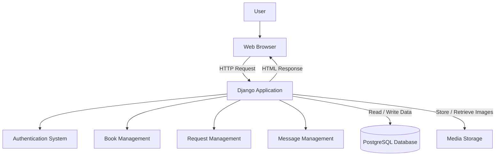
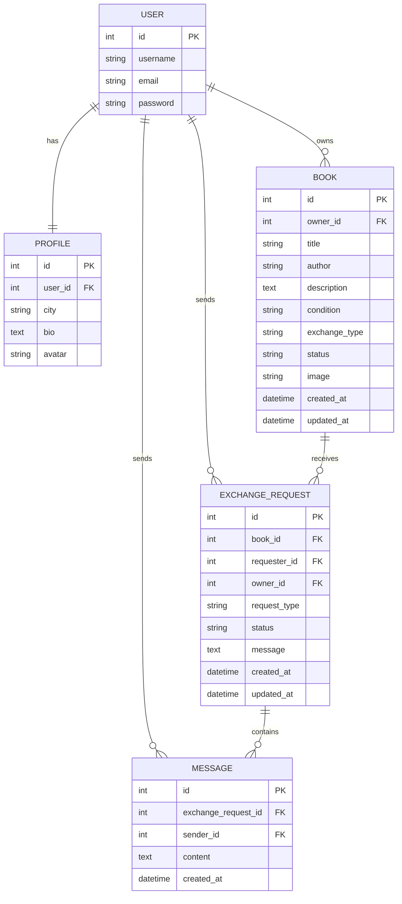
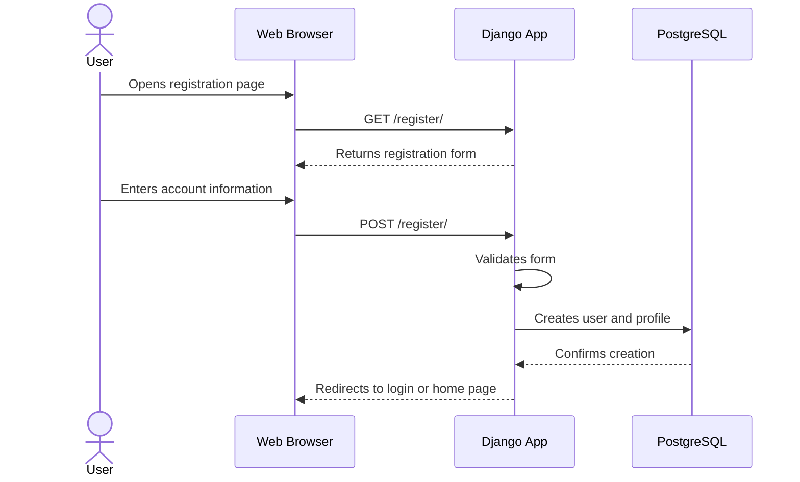
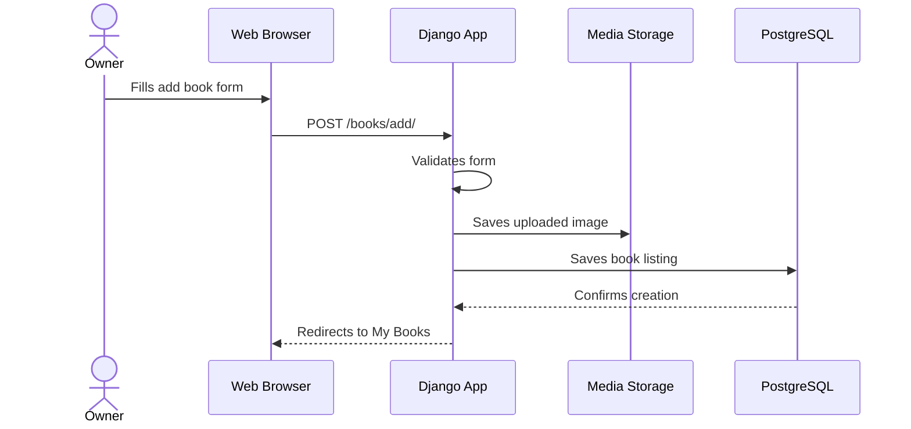
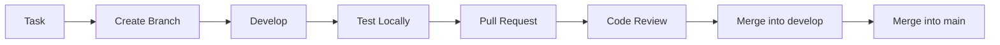

# Livract — MVP Technical Documentation
## Project Overview
Livract is a web application that helps people in a local community share, lend, give, or exchange books.
### Chosen Stack
| Layer | Technology |
|---|---|
| Front-end | HTML, CSS, Django Templates |
| Back-end | Python, Django |
| Database | PostgreSQL |
| Authentication | Django Authentication |
| Media Storage | Local media storage for MVP |
| Version Control | Git and GitHub |
---
# 0. User Stories and Mockups
## 0.1 MVP Goal
The MVP must prove that users can share books and organize exchanges inside a local community.
It must remain focused on the core product idea.
It does not need payments, delivery tracking, AI recommendations, or real-time geolocation.
The first version must be simple, testable, and usable.
## 0.2 User Stories
### Must Have
* As a reader, I want to register and log in, so that I can access the platform and manage my books securely
* As a reader, I want to add a book to my library with a sharing type (loan, gift, exchange, sale), so that other readers can find it
* As a reader, I want to browse books available around me on a map, so that I can find what is close to me
* As a reader, I want to send a sharing request with a message, so that I can get a book from another reader
* As a reader, I want to accept or decline a sharing request I received, so that I stay in control of my books
* As a reader, I want to chat with the other reader once a request is accepted, so that we can organize the exchange
* As a reader, I want to create a profile with a bio and my reading preferences, so that other readers can know who I am
* As an individual, I want to post a literary event for free, so that readers nearby can discover and join it
* As a professional, I want to post a limited number of events for free, so that I can test the platform before committing
* As a professional, I want to pay to post additional events beyond my free quota, so that I can continue promoting my activities on the platform
* As a professional, I want to manage my posted events, so that I can update or cancel them if needed

### Should Have (important, but not critical for MVP)

* As a reader, I want to filter books by exchange type, distance, genre and condition, so that I can quickly find what I'm looking for
* As a reader, I want to search a book by title, author, genre or theme, so that I can find a specific book
* As a reader, I want to see other readers around me and visit their profile, so that I can discover people with similar tastes
* As a reader, I want to follow another reader, so that I can stay updated on their shared books
* As a reader, I want to browse events near me filtered by type and date, so that I can participate in the local literary scene
* As a professional, I want to see how many free event slots I have left, so that I know when I will need to pay
* As an admin, I want to manage professional accounts and their quotas, so that I can control access to paid features

### Could Have (nice to have, future)

* As a reader, I want to add a review and personal notes on a book, so that other readers can benefit from my experience
* As a reader, I want to receive a notification when a book I'm looking for becomes available nearby
* As a reader, I want to earn a reader title based on my activity, so that my profile reflects my reading personality
* As a professional, I want to access analytics on my events (views, participants), so that I can measure their impact

### Won't Have (excluded for MVP)

* As a professional, I want to subscribe to a monthly plan for unlimited event posting (future pricing model)
* As a reader, I want to get AI-powered book recommendations based on my library (too complex for MVP)
* As an admin, I want to see global platform revenue and statistics (future feature)
## 0.3 Mockups
The MVP uses a simple web interface.
The mockups can be created in Figma, but the following wireframes define the expected screens.
### Main Screens
| Screen | Purpose |
|---|---|
| Login Page | Allows existing users to log in. |
| Register Page | Allows new users to create an account. |
| Home Page | Displays available books. |
| Book Details Page | Shows all information about a selected book. |
| Add Book Page | Allows users to create a book listing. |
| Edit Book Page | Allows owners to update a listing. |
| My Books Page | Shows books created by the current user. |
| Requests Page | Shows sent and received requests. |
| Messages Page | Shows messages linked to a request. |
| Profile Page | Shows and edits user profile information. |

# 1. System Architecture
## 1.1 Architecture Choice
Livract uses a simple 3-tier Django architecture.
The architecture is: Web Browser → Django Application → PostgreSQL Database.
This structure is realistic for a small MVP and can be built mainly with Python.
It avoids unnecessary complexity such as microservices or a separate mobile back-end.
Django handles routing, views, templates, forms, authentication, permissions, and business logic.
PostgreSQL stores all relational data used by the application.
Book images are stored in local media storage for the MVP.
Cloud image storage can be added later if the app is deployed publicly.
## 1.2 Architecture Diagram

## 1.3 Architecture Layers
### Presentation Layer
The presentation layer is built with HTML, CSS, and Django templates.
It displays pages, forms, book cards, request cards, and messages.
It is responsible for the visible part of the application.
### Application Layer
The application layer is the Django project.
It handles user actions, validates forms, checks permissions, and applies business rules.
This layer decides what users are allowed to do.
### Data Layer
The data layer is PostgreSQL.
It stores users, profiles, books, exchange requests, and messages.
The Django ORM is used to communicate with the database.
## 1.4 Data Flow
1. The user opens a page in the browser.
2. The browser sends an HTTP request to Django.
3. Django routes the request to the correct view.
4. The view checks authentication and permissions if needed.
5. The view reads or writes data using Django models.
6. PostgreSQL returns the requested data.
7. Django renders an HTML template.
8. The browser displays the updated page to the user.
## 1.5 Why This Architecture Fits the MVP
- It is easy to understand.
- It is easy to explain in the project documentation.
- It can be implemented by a small team.
- It uses Python for most of the back-end work.
- It avoids unnecessary mobile complexity.
- It works well with relational data.
- It can later evolve into a REST API or a mobile app.
---
# 2. Components, Classes, and Database Design
## 2.1 Front-End Components
The front-end is server-rendered using Django templates.
Each page is connected to a Django view.
Reusable UI blocks can be separated into template partials.
| Component | Type | Responsibility |
|---|---|---|
| BaseTemplate | Template | Provides common layout, navigation, and page structure. |
| HomePage | Page | Displays available books and search filters. |
| LoginPage | Page | Displays the login form. |
| RegisterPage | Page | Displays the registration form. |
| ProfilePage | Page | Displays and updates user information. |
| BookCard | Partial | Displays a short book preview. |
| BookDetailsPage | Page | Displays detailed information about a book. |
| AddBookPage | Page | Displays a form to add a book. |
| EditBookPage | Page | Displays a form to edit a book. |
| MyBooksPage | Page | Displays books owned by the current user. |
| RequestsPage | Page | Displays sent and received requests. |
| RequestCard | Partial | Displays request status and possible actions. |
| MessagesPage | Page | Displays conversation messages for one request. |
| MessageItem | Partial | Displays one message. |
| SearchForm | Form | Allows the user to search or filter books. |
## 2.2 Back-End Components
The Django project is separated into apps to keep the code easier to maintain.
```text
livract/
├── accounts/
├── books/
├── exchanges/
├── messaging/
├── core/
├── templates/
├── static/
└── media/
```
| Django App | Responsibility |
|---|---|
| `accounts` | Registration, login, logout, and profile management. |
| `books` | Book listings, search, creation, update, and deletion. |
| `exchanges` | Borrowing, giving, and exchange requests. |
| `messaging` | Messages connected to exchange requests. |
| `core` | Homepage, shared views, and general pages. |
## 2.3 Models and Classes
The main models are User, Profile, Book, ExchangeRequest, and Message.
Django already provides the base User model.
Livract adds custom models for product-specific data.
### User
The User model is provided by Django.
It manages username, email, password, authentication, and permissions.
### Profile
| Field | Type | Description |
|---|---|---|
| `user` | OneToOneField | Linked Django user. |
| `city` | CharField | User city or local community. |
| `bio` | TextField | Optional user description. |
| `avatar` | ImageField | Optional profile picture. |
| `created_at` | DateTimeField | Profile creation date. |
| `updated_at` | DateTimeField | Last profile update date. |
### Book
| Field | Type | Description |
|---|---|---|
| `owner` | ForeignKey | User who owns the book. |
| `title` | CharField | Book title. |
| `author` | CharField | Book author. |
| `description` | TextField | Optional book description. |
| `condition` | CharField | New, good, used, or damaged. |
| `exchange_type` | CharField | Lend, give, or exchange. |
| `status` | CharField | Available, reserved, or unavailable. |
| `image` | ImageField | Optional book image. |
| `created_at` | DateTimeField | Listing creation date. |
| `updated_at` | DateTimeField | Last listing update date. |
### ExchangeRequest
| Field | Type | Description |
|---|---|---|
| `book` | ForeignKey | Requested book. |
| `requester` | ForeignKey | User who sends the request. |
| `owner` | ForeignKey | Owner of the requested book. |
| `request_type` | CharField | Borrow, give, or exchange. |
| `status` | CharField | Pending, accepted, rejected, cancelled, or completed. |
| `message` | TextField | Optional first message. |
| `created_at` | DateTimeField | Request creation date. |
| `updated_at` | DateTimeField | Last request update date. |
### Message
| Field | Type | Description |
|---|---|---|
| `exchange_request` | ForeignKey | Request conversation linked to the message. |
| `sender` | ForeignKey | User who sent the message. |
| `content` | TextField | Message text. |
| `created_at` | DateTimeField | Message creation date. |
## 2.4 Database Design
Livract uses a relational database because the entities are strongly connected.
A user owns books.
A user sends requests.
A book receives requests.
A request contains messages.
These relationships are well suited for PostgreSQL.
### Entity Relationship Diagram

### Main Tables
| Table | Purpose |
|---|---|
| `auth_user` | Stores Django user accounts. |
| `profiles` | Stores additional user profile data. |
| `books` | Stores book listings. |
| `exchange_requests` | Stores requests for books. |
| `messages` | Stores conversation messages. |
### Validation Rules
| Area | Rule |
|---|---|
| User | Username and email are required. |
| Profile | City is required for local community context. |
| Book | Title, author, condition, exchange type, and status are required. |
| Book | Only the owner can edit or delete a book. |
| ExchangeRequest | A user cannot request their own book. |
| ExchangeRequest | Only the owner can accept or reject a request. |
| Message | Only users involved in the request can view or send messages. |
---
# 3. High-Level Sequence Diagrams
This section describes the main interactions of the MVP.
The diagrams are high-level and focus on the most important flows.
## 3.1 User Registration

## 3.2 Add a Book

## 3.3 Send a Book Request

---
# 4. Internal and External APIs
For the first MVP, Livract uses Django views and server-rendered pages.
A separate REST API is not required in the initial version.
However, the internal routes are documented like API endpoints.
## 4.1 External Services
| Service | Purpose |
|---|---|
| Django Authentication | Handles user registration, login, logout, and sessions. |
| PostgreSQL | Stores relational application data. |
| GitHub | Stores code and documentation. |
## 4.2 Internal Routes
### Authentication and Profiles
| Method | Route | Description |
|---|---|---|
| GET | `/register/` | Display registration form. |
| POST | `/register/` | Create a new account. |
| GET | `/login/` | Display login form. |
| POST | `/login/` | Authenticate user. |
| POST | `/logout/` | Log out current user. |
| GET | `/profile/` | Display current user profile. |
| POST | `/profile/edit/` | Update current user profile. |
### Books
| Method | Route | Description |
|---|---|---|
| GET | `/books/` | Display available books. |
| GET | `/books/?search=value` | Search books. |
| GET | `/books/<id>/` | Display one book. |
| GET | `/books/add/` | Display add book form. |
| POST | `/books/add/` | Create a book listing. |
| GET | `/books/<id>/edit/` | Display edit book form. |
| POST | `/books/<id>/edit/` | Update a book listing. |
| POST | `/books/<id>/delete/` | Delete a book listing. |
| GET | `/my-books/` | Display current user's books. |
### Requests and Messages
| Method | Route | Description |
|---|---|---|
| POST | `/books/<id>/request/` | Send a request for a book. |
| GET | `/requests/` | Display sent and received requests. |
| POST | `/requests/<id>/accept/` | Accept a received request. |
| POST | `/requests/<id>/reject/` | Reject a received request. |
| POST | `/requests/<id>/cancel/` | Cancel a sent request. |
| GET | `/requests/<id>/messages/` | Display messages for one request. |
| POST | `/requests/<id>/messages/` | Send a message in a request conversation. |
## 4.3 Security Rules
- Only authenticated users can add books.
- Only authenticated users can send requests.
- Only a book owner can edit or delete their book.
- Only a book owner can accept or reject a request.
- Only the requester or owner can read request messages.
- Only the requester or owner can send messages in a request conversation.
- Anonymous users can browse public book listings.
---
# 5. SCM and QA Strategy
## 5.1 Source Control Management
The project uses Git for version control and GitHub for remote hosting.
GitHub also supports issues, pull requests, documentation, and team collaboration.
### Repository Structure
```text
livract/
├── accounts/
├── books/
├── exchanges/
├── messaging/
├── core/
├── templates/
├── static/
├── media/
├── docs/
├── manage.py
├── requirements.txt
└── README.md
```
### Branching Strategy
| Branch | Purpose |
|---|---|
| `main` | Stable version. |
| `develop` | Integration branch. |
| `feature/*` | New features. |
| `fix/*` | Bug fixes. |
| `docs/*` | Documentation updates. |
### Development Workflow

### Commit Examples
```text
feat: add book creation form
feat: create exchange request model
fix: prevent users from editing another user's book
fix: block requests on unavailable books
docs: update architecture documentation
test: add tests for book model
refactor: simplify request status logic
```
## 5.2 QA Strategy
The goal of QA is to make sure the application is functional, stable, secure, and aligned with the MVP requirements.
### Testing Types
| Test Type | Purpose | Tool |
|---|---|---|
| Unit Tests | Test models and forms. | Django TestCase. |
| View Tests | Test pages, redirects, and permissions. | Django Test Client. |
| Manual Tests | Test the application in a browser. | Browser. |
| Database Tests | Check relationships and constraints. | Django ORM. |
| Regression Tests | Make sure existing features still work. | Manual checklist. |
### Main Features to Test
| Feature | Expected Result |
|---|---|
| Authentication | User can register, log in, and log out. |
| Profiles | User can view and edit their profile. |
| Books | User can add, edit, delete, and search books. |
| Permissions | User cannot edit another user's book. |
| Requests | User can request an available book. |
| Requests | User cannot request their own book. |
| Status | Owner can accept or reject a request. |
| Messages | Users involved in a request can exchange messages. |
| Security | Unrelated users cannot access private conversations. |
### Manual Test Checklist
| Flow | Expected Result |
|---|---|
| Register | Account is created. |
| Login | User accesses the application. |
| Logout | User session ends. |
| Add book | Book appears in the list. |
| Edit book | Book information is updated. |
| Delete book | Book is removed from the user's list. |
| Search book | Matching results are displayed. |
| Send request | Request appears as pending. |
| Accept request | Request becomes accepted. |
| Reject request | Request becomes rejected. |
| Send message | Message appears in the conversation. |
| Open profile | Profile information is displayed. |
## 5.3 Deployment Strategy
For the MVP, deployment should remain simple.
```text
Local Development → Testing → Staging → Production
```
### Possible Tools
| Need | Tool |
|---|---|
| Code hosting | GitHub. |
| Back-end hosting | Render, Railway, or PythonAnywhere. |
| Database | PostgreSQL. |
| Static files | WhiteNoise. |
| Media files | Local storage for MVP, Cloudinary later. |
| CI/CD | GitHub Actions. |
### Definition of Done
- A feature works locally.
- The code is pushed to a dedicated branch.
- Basic tests pass.
- A pull request is opened.
- The code is reviewed.
- No critical bug remains.
- Documentation is updated if necessary.
- The feature is merged into develop.
---
# Final Summary
Livract is designed as a simple Django MVP.
The architecture is based on a browser, a Django application, and a PostgreSQL database.
The main entities are User, Profile, Book, ExchangeRequest, and Message.
The first version focuses on the core exchange flow instead of complex advanced features.
This approach is realistic for a small team and suitable for a first working version.
The project can later evolve toward a REST API, a React Native mobile app, real-time chat, and cloud media storage.
