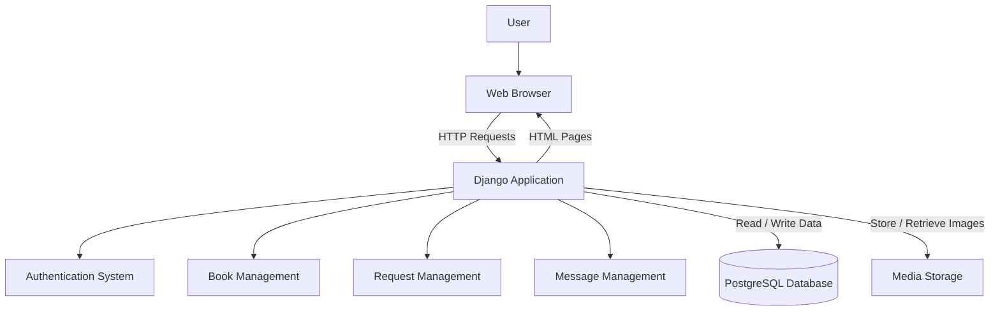
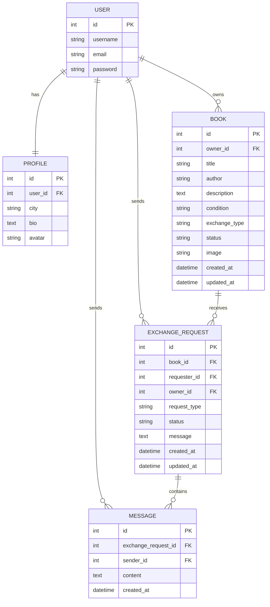
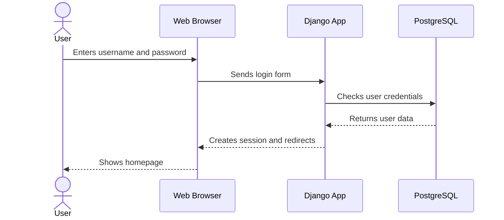
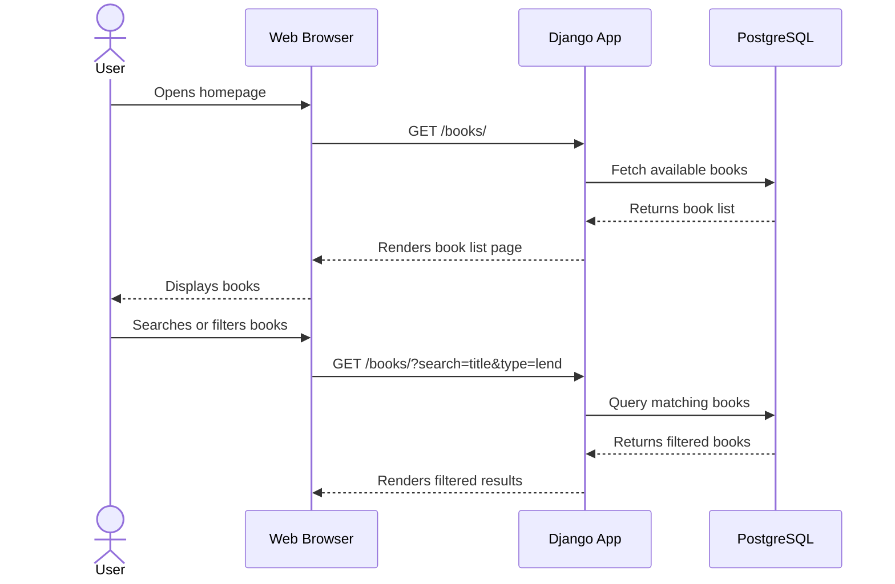
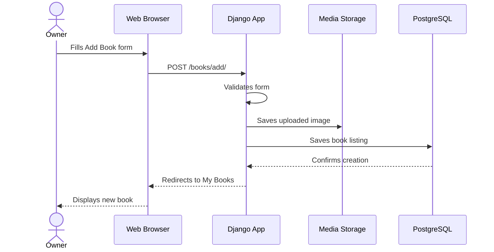
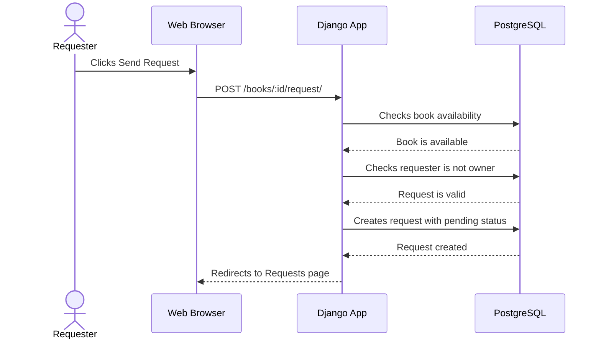
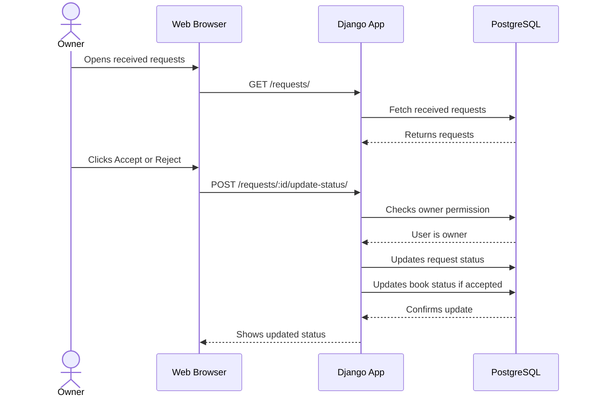
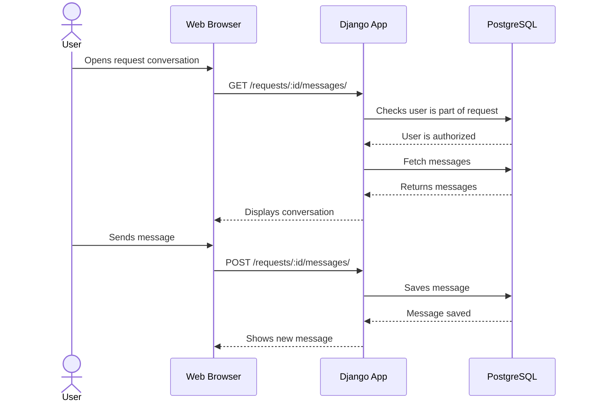
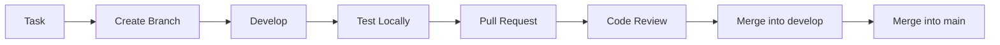

# Livract — MVP Technical Documentation

## Table of Contents

- [0) User Stories and Mockups](#0-user-stories-and-mockups)
  - [0.1 User Stories](#01-user-stories)
  - [0.2 Mockups](#02-mockups)
- [1) Design System Architecture](#1-design-system-architecture)
- [2) Components, Classes and Database Design](#2-components-classes-and-database-design)
  - [2.1 Front-End Components](#21-front-end-components)
  - [2.2 Back-End Components](#22-back-end-components)
  - [2.3 Database Design](#23-database-design)
- [3) High-Level Sequence Diagrams](#3-high-level-sequence-diagrams)
- [4) API and Methods](#4-api-and-methods)
- [5) SCM and QA Strategy](#5-scm-and-qa-strategy)

---

<p align="center">
  
  
  
  
  
</p>

<p align="center">
  <b>Python</b> • <b>Django</b> • <b>PostgreSQL</b> • <b>HTML</b> • <b>CSS</b>
</p>

---

# 0) User Stories and Mockups

## 0.1 User Stories

Livract is a web application that helps people in the same local community share, lend, give, or exchange books.

The MVP focuses on the essential features needed to create book listings, browse available books, send requests, and communicate with other users.

---

### Must Have

- As a **new user**, I want to **create an account**, so that I can access Livract securely.
- As a **user**, I want to **log in and log out**, so that I can protect my account.
- As a **user**, I want to **create a basic profile**, so that other users can identify me.
- As a **book owner**, I want to **add a book listing**, so that other users can discover my book.
- As a **book owner**, I want to **edit or delete my book listing**, so that I can keep my information up to date.
- As a **user**, I want to **browse available books**, so that I can find books shared by the community.
- As a **user**, I want to **search or filter books**, so that I can quickly find books that interest me.
- As a **user**, I want to **send a request for a book**, so that I can ask to borrow, receive, or exchange it.
- As a **book owner**, I want to **accept or reject requests**, so that I can control who receives or borrows my book.

---

### Should Have

- As a **user**, I want to **send messages linked to a request**, so that I can organize the exchange with the other user.
- As a **user**, I want to **see the status of my requests**, so that I know if they are pending, accepted, or rejected.
- As a **book owner**, I want the **book availability to change automatically**, so that unavailable books are not requested again.
- As a **user**, I want to **see my own listed books**, so that I can manage them easily.

---

### Could Have

- As a **user**, I want to **save favorite books**, so that I can find them again later.
- As a **user**, I want to **receive notifications**, so that I know when someone answers my request.
- As a **user**, I want to **filter books by city area**, so that I can find books near me.
- As a **user**, I want to **review another user after an exchange**, so that the community becomes more trustworthy.

---

### Won’t Have for MVP

- Online payment system.
- Delivery tracking.
- AI book recommendations.
- Advanced admin moderation dashboard.
- Real-time geolocation.

---

## 0.2 Mockups

The MVP has a simple web interface. The main screens are:

| Screen | Purpose |
|---|---|
| Login / Register Page | Allows users to create an account or log in |
| Home Page | Displays available books |
| Book Details Page | Shows full information about one book |
| Add Book Page | Allows users to publish a book listing |
| My Books Page | Allows users to manage their own books |
| Requests Page | Displays sent and received requests |
| Messages Page | Allows users to discuss a request |
| Profile Page | Shows and updates user profile information |

---

### Example Home Page Wireframe

```text
------------------------------------------------
| Livract                 Search      Profile   |
------------------------------------------------
| Search for a book...                          |
| [All] [Lend] [Give] [Exchange]                |
------------------------------------------------
| Book Card                                      |
| Title: The Hobbit                             |
| Author: J.R.R. Tolkien                        |
| Condition: Good                               |
| Status: Available                             |
| [View Details]                                |
------------------------------------------------
| Book Card                                      |
| Title: 1984                                   |
| Author: George Orwell                         |
| Condition: Used                               |
| Status: Available                             |
| [View Details]                                |
------------------------------------------------
```

---

### Example Book Details Wireframe

```text
------------------------------------------------
| Back                                           |
------------------------------------------------
| Book image                                    |
| Title: The Hobbit                             |
| Author: J.R.R. Tolkien                        |
| Condition: Good                               |
| Type: Lend                                    |
| Owner: Andric                                 |
| Availability: Available                       |
------------------------------------------------
| [Send Request]                                |
------------------------------------------------
```

---

# 1) Design System Architecture

Livract uses a simple **3-tier architecture**.

```text
Web Browser → Django Application → PostgreSQL Database
```

This architecture is suitable for an MVP because it is simple, realistic, and can be built mainly with Python.

---

## Architecture Diagram



---

## Explanation

- **Web Browser**  
  The user accesses Livract through a browser.

- **Django Application**  
  Django handles routes, views, forms, authentication, permissions, and business logic.

- **PostgreSQL Database**  
  Stores users, profiles, books, requests, and messages.

- **Media Storage**  
  Stores uploaded book images.

---

## Data Flow

```text
User → Browser → Django View → Database → Django Template → Browser
```

Step by step:

1. The user opens a page.
2. The browser sends an HTTP request to Django.
3. Django processes the request.
4. Django reads or writes data in PostgreSQL.
5. Django returns an HTML page.
6. The user sees the updated page.

---

# 2) Components, Classes and Database Design

## 2.1 Front-End Components

The front-end is built with **HTML**, **CSS**, and **Django templates**.

| Component / Page | Type | Purpose |
|---|---|---|
| `HomePage` | Page | Displays available books |
| `LoginPage` | Page | Allows users to log in |
| `RegisterPage` | Page | Allows users to create an account |
| `BookDetailsPage` | Page | Shows detailed information about one book |
| `AddBookPage` | Page | Allows users to add a book listing |
| `EditBookPage` | Page | Allows book owners to update a listing |
| `MyBooksPage` | Page | Displays books created by the current user |
| `RequestsPage` | Page | Shows sent and received requests |
| `MessagesPage` | Page | Displays messages linked to a request |
| `ProfilePage` | Page | Shows and updates user profile |
| `BookCard` | UI Component | Displays a book preview |
| `SearchBar` | UI Component | Allows users to search books |
| `FilterForm` | UI Component | Allows users to filter books |
| `RequestCard` | UI Component | Displays request status and actions |

---

## 2.2 Back-End Components

The Django project is divided into several apps.

```text
livract/
├── accounts/
├── books/
├── exchanges/
├── messaging/
├── core/
├── templates/
├── static/
└── media/
```

| App | Responsibility |
|---|---|
| `accounts` | User registration, login, logout, profile |
| `books` | Book creation, editing, deleting, search |
| `exchanges` | Borrow, give, and exchange requests |
| `messaging` | Messages linked to requests |
| `core` | Homepage, shared views, general logic |

---

## Main Classes / Models

### User

Django already provides a built-in `User` model.

It manages:

- username;
- email;
- password;
- authentication;
- permissions.

---

### Profile

The `Profile` model extends the user account with Livract-specific information.

| Attribute | Type | Description |
|---|---|---|
| `user` | OneToOneField | Linked Django user |
| `city` | CharField | User city |
| `bio` | TextField | Optional description |
| `avatar` | ImageField | Optional profile picture |

---

### Book

Represents a book listing.

| Attribute | Type | Description |
|---|---|---|
| `owner` | ForeignKey | User who owns the book |
| `title` | CharField | Book title |
| `author` | CharField | Book author |
| `description` | TextField | Optional description |
| `condition` | CharField | New, good, used, damaged |
| `exchange_type` | CharField | Lend, give, exchange |
| `status` | CharField | Available, reserved, unavailable |
| `image` | ImageField | Optional book image |
| `created_at` | DateTimeField | Creation date |
| `updated_at` | DateTimeField | Last update date |

---

### ExchangeRequest

Represents a request sent by one user for a book.

| Attribute | Type | Description |
|---|---|---|
| `book` | ForeignKey | Requested book |
| `requester` | ForeignKey | User sending the request |
| `owner` | ForeignKey | Owner of the book |
| `request_type` | CharField | Borrow, give, exchange |
| `status` | CharField | Pending, accepted, rejected, cancelled, completed |
| `message` | TextField | Optional first message |
| `created_at` | DateTimeField | Creation date |
| `updated_at` | DateTimeField | Last update date |

---

### Message

Represents a message inside an exchange request.

| Attribute | Type | Description |
|---|---|---|
| `exchange_request` | ForeignKey | Related request |
| `sender` | ForeignKey | User who sent the message |
| `content` | TextField | Message text |
| `created_at` | DateTimeField | Message creation date |

---

## Backend Components Overview

| Component | Simple Meaning | What it Does | Main Model |
|---|---|---|---|
| Authentication | Login system | Handles registration, login, logout | User |
| Profile Service | User identity | Stores city, bio, avatar | Profile |
| Book Service | Book catalog | Creates, updates, deletes, searches books | Book |
| Request Service | Exchange system | Handles borrow/give/exchange requests | ExchangeRequest |
| Message Service | Communication | Allows users to discuss a request | Message |

---

## 2.3 Database Design

Livract uses a relational database because the project has clear relationships between users, books, requests, and messages.

---

## Entity Relationship Diagram



---

## Database Tables

| Table | What it Represents | Main Fields |
|---|---|---|
| `auth_user` | Django user accounts | `id`, `username`, `email`, `password` |
| `profiles` | User profile information | `user_id`, `city`, `bio`, `avatar` |
| `books` | Book listings | `owner_id`, `title`, `author`, `condition`, `status` |
| `exchange_requests` | Requests for books | `book_id`, `requester_id`, `owner_id`, `status` |
| `messages` | Conversation messages | `exchange_request_id`, `sender_id`, `content` |

---

## In Short

- **User** = who uses the app.
- **Profile** = extra information about the user.
- **Book** = what users share.
- **ExchangeRequest** = what users ask for.
- **Message** = how users communicate.

---

# 3) High-Level Sequence Diagrams

This section shows the main interactions of the Livract MVP.

The most important user flows are:

1. User registration and login.
2. Browsing books.
3. Adding a book.
4. Sending a request.
5. Accepting or rejecting a request.
6. Sending a message.

---

## 3.1 User Login



### Explanation

1. The user enters their login information.
2. Django receives the form.
3. Django checks the credentials.
4. If valid, Django creates a session.
5. The user is redirected to the homepage.

---

## 3.2 Browse and Search Books



### Explanation

1. The user opens the book list.
2. Django asks the database for available books.
3. The database returns the books.
4. Django displays the books in the page.
5. If the user searches, Django filters the results.

---

## 3.3 Add a Book Listing



### Explanation

1. The owner fills the form.
2. Django validates the data.
3. The image is saved.
4. The book is stored in PostgreSQL.
5. The new book appears in the user’s listings.

---

## 3.4 Send a Book Request



### Explanation

1. The user requests a book.
2. Django checks if the book is available.
3. Django checks that the requester is not the owner.
4. The request is saved with a `pending` status.

---

## 3.5 Accept or Reject a Request



---

## 3.6 Send a Message



---

# 4) API and Methods

For the first Django MVP, Livract mainly uses server-rendered pages with Django views and forms.

A full REST API is not required for the first version, but the internal routes can still be documented clearly.

---

## 4.1 External APIs Used

| API / Service | Purpose | Why Chosen |
|---|---|---|
| Django Authentication | User login and registration | Built into Django and simple for MVP |
| PostgreSQL | Relational database | Good for users, books, requests, and messages |
| Local Media Storage | Book image upload | Simple for development and MVP |
| Cloudinary | Future image hosting | Useful later for production image storage |

---

## 4.2 Internal Routes

### Authentication and Profiles

| Method | Route | Description |
|---|---|---|
| GET | `/register/` | Display registration page |
| POST | `/register/` | Create a new account |
| GET | `/login/` | Display login page |
| POST | `/login/` | Log in user |
| POST | `/logout/` | Log out user |
| GET | `/profile/` | Display current user profile |
| POST | `/profile/edit/` | Update current user profile |

---

### Books

| Method | Route | Description |
|---|---|---|
| GET | `/books/` | Display available books |
| GET | `/books/?search=value` | Search books |
| GET | `/books/<id>/` | Display one book |
| GET | `/books/add/` | Display add book form |
| POST | `/books/add/` | Create book listing |
| GET | `/books/<id>/edit/` | Display edit form |
| POST | `/books/<id>/edit/` | Update book listing |
| POST | `/books/<id>/delete/` | Delete book listing |
| GET | `/my-books/` | Display current user’s books |

---

### Requests

| Method | Route | Description |
|---|---|---|
| POST | `/books/<id>/request/` | Send request for a book |
| GET | `/requests/` | Display sent and received requests |
| POST | `/requests/<id>/accept/` | Accept request |
| POST | `/requests/<id>/reject/` | Reject request |
| POST | `/requests/<id>/cancel/` | Cancel request |

---

### Messages

| Method | Route | Description |
|---|---|---|
| GET | `/requests/<id>/messages/` | Display request conversation |
| POST | `/requests/<id>/messages/` | Send message in request conversation |

---

## In Short

- Authentication routes manage accounts.
- Book routes manage book listings.
- Request routes manage borrowing, giving, and exchanges.
- Message routes manage communication between users.

---

# 5) SCM and QA Strategy

## 5.1 Source Control Management

The project uses **Git** and **GitHub**.

Recommended branches:

| Branch | Purpose |
|---|---|
| `main` | Stable version |
| `develop` | Integration branch |
| `feature/*` | New features |
| `fix/*` | Bug fixes |
| `docs/*` | Documentation changes |

---

## Workflow



---

## Commit Examples

```text
feat: add book creation form
feat: create request model
fix: prevent users from requesting their own books
docs: update database documentation
test: add tests for book model
```

---

## 5.2 QA Strategy

The goal of QA is to make sure the MVP is functional, stable, and secure.

---

## Testing Types

| Test Type | Purpose | Tools |
|---|---|---|
| Unit Tests | Test models and forms | Django TestCase |
| View Tests | Test Django views and permissions | Django Test Client |
| Manual Tests | Test user flows in the browser | Browser |
| Database Tests | Check relationships and constraints | Django ORM |
| Regression Tests | Make sure existing features still work | Manual checklist |

---

## Main Features to Test

| Feature | Test Case |
|---|---|
| Authentication | User can register, log in, and log out |
| Profiles | User can update profile |
| Books | User can add, edit, delete, and search books |
| Permissions | User cannot edit another user’s book |
| Requests | User can request a book |
| Requests | User cannot request their own book |
| Status | Owner can accept or reject a request |
| Messages | Users can send messages inside a request |

---

## Manual Test Checklist

| Flow | Expected Result |
|---|---|
| Register | Account is created |
| Login | User accesses the app |
| Add book | Book appears in the book list |
| Edit book | Book information updates |
| Delete book | Book disappears from user’s books |
| Search book | Matching results are displayed |
| Send request | Request appears as pending |
| Accept request | Request becomes accepted |
| Reject request | Request becomes rejected |
| Send message | Message appears in the conversation |

---

## 5.3 Deployment Pipeline

For the MVP, the deployment process stays simple.

```text
Local Development → Testing → Staging → Production
```

Possible tools:

| Need | Tool |
|---|---|
| Code hosting | GitHub |
| Back-end hosting | Render, Railway, or PythonAnywhere |
| Database | PostgreSQL |
| Static files | WhiteNoise |
| Media files | Local storage for MVP, Cloudinary later |
| CI/CD | GitHub Actions |

---

## Deployment Steps

1. Develop features locally.
2. Push code to GitHub.
3. Open a pull request.
4. Run tests.
5. Merge into `develop`.
6. Test the app in staging.
7. Merge into `main`.
8. Deploy the stable version.

---

## In Short

- Use Git and GitHub.
- Work with feature branches.
- Use pull requests.
- Test the most important flows first.
- Keep deployment simple for the MVP.
- Improve automation later with GitHub Actions.

---

# Final Summary

Livract is designed as a simple Django MVP.

The architecture is:

```text
Browser → Django Web App → PostgreSQL
```

The main entities are:

- User
- Profile
- Book
- ExchangeRequest
- Message

This structure is realistic for a first version, easy to explain, and easier to build than a complex mobile architecture.
